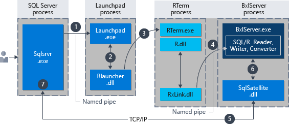
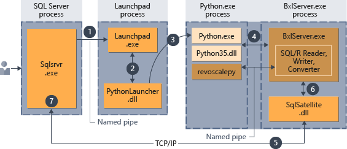
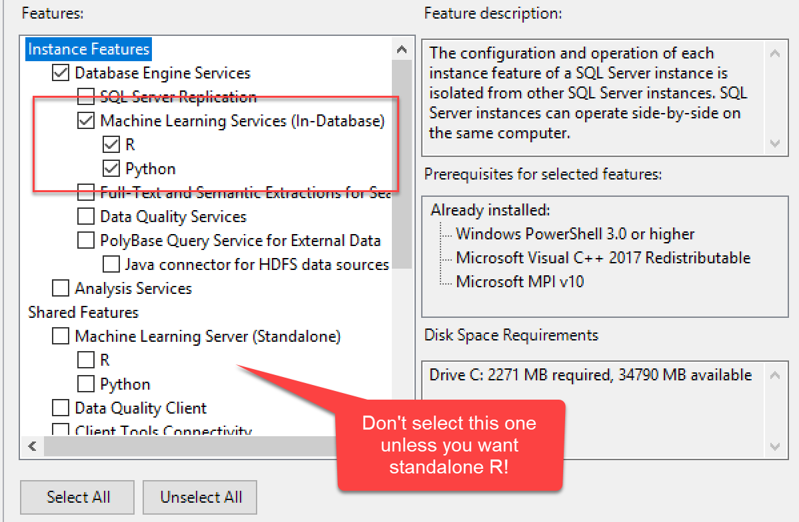
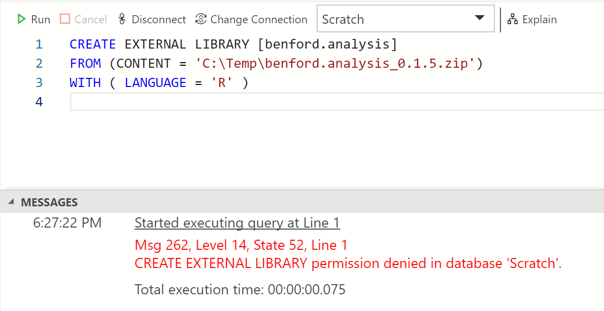
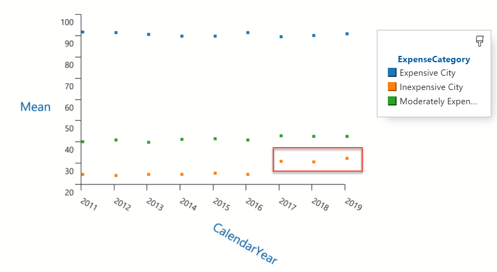
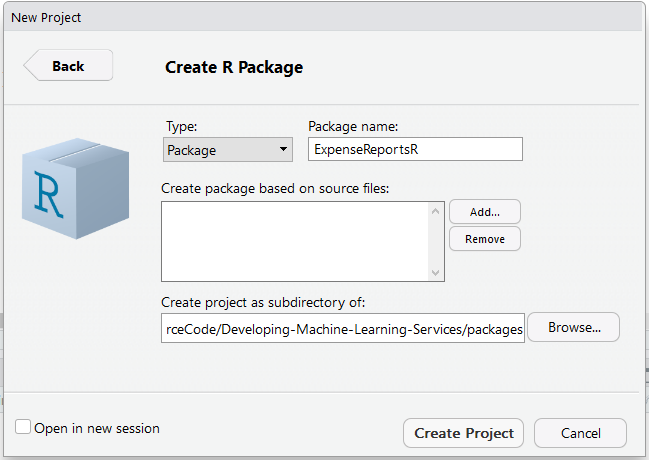
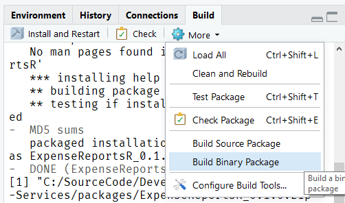
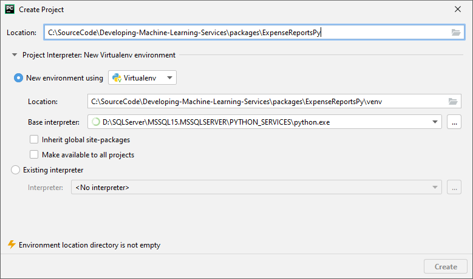
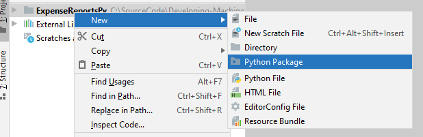

<style>
.reveal section img { background:none; border:none; box-shadow:none; }
</style>

## Developing a Solution with SQL Server Machine Learning Services

<a href="http://www.catallaxyservices.com">Kevin Feasel</a> (<a href="https://twitter.com/feaselkl">@feaselkl</a>)<br />
<a href="http://csmore.info/on/mlservicesdev">http://CSmore.info/on/mlservicesdev</a>

---

@title[Who Am I?]

@div[left-60]
<table>
	<tr>
		<td><a href="https://csmore.info"></a></td>
		<td><a href="https://csmore.info">Catallaxy Services</a></td>
	</tr>
	<tr>
		<td><a href="https://curatedsql.com"></a></td>
		<td><a href="https://curatedsql.com">Curated SQL</a></td>
	</tr>
	<tr>
		<td><a href="https://www.apress.com/us/book/9781484254608"></a></td>
		<td><a href="https://www.apress.com/us/book/9781484254608">PolyBase Revealed</a></td>
	</tr>
</table>
@divend

@div[right-40]
	<br /><br />
	<a href="https://www.twitter.com/feaselkl"></a>
	<br />
	<a href="https://www.twitter.com/feaselkl">@feaselkl</a>
</div>
@divend

---?image=presentation/assets/background/questions.jpg&size=cover&opacity=20

### What is ML Services?

SQL Server Machine Learning Services (ML Services) was originally released as SQL Server R Services with SQL Server 2016.

Since then, Microsoft added support for Python in SQL Server 2017 and renamed the product accordingly.

With SQL Server 2019, Microsoft is adding Java support as well and has opened the door to other languages too.

---?image=presentation/assets/background/motivation.jpg&size=cover&opacity=20

### Motivation

My goals in this talk:

* Introduce you to SQL Server Machine Learning Services.
* Discuss when ML Services might be a fit.
* Install and configure ML Services.
* Cover external script execution.
* Build a basic project and deploy custom code.

---

@title[An Overview]

## Agenda
1. **An Overview**
2. Installing ML Services
3. Installing Packages
4. External Script Execution
5. Building a Project
6. Deploying Custom Code

---

### How It Works:  R

<br />
<a href="https://docs.microsoft.com/en-us/sql/machine-learning/concepts/extension-r?view=sql-server-ver15">Source</a>

---

### How It Works:  Python

<br />
<a href="https://docs.microsoft.com/en-us/sql/machine-learning/concepts/extension-python?view=sql-server-ver15">Source</a>

---

### Native Scoring

SQL Server has built-in native C++ implementations for the following algorithms:

|RevoScaleR|revoscalepy|Desc|
|----------|-----------|----|
|rxLinMod|rx_lin_mod|Linear Regression|
|rxLogit|rx_logit|Logistic Regression|
|rxDtree|rx_dtree|Decision Tree|
|rxDForest|rx_dforest|Random Forest|
|rxBTrees|rx_btrees|Boosted Decision Trees|

---

### The Upshot

Machine Learning Services brings ML code to the data, reducing data movement and extending functionality inside SQL Server.

We can use Resource Governor to limit CPU and memory utilization.  See <a href="http://csmore.info/on/mlservices">http://CSmore.info/on/mlservices</a> for more information on this.

---?image=presentation/assets/background/jump.jpg&size=cover&opacity=20

### What Works Well

These kinds of scenarios work really well with SQL Server ML Services:

1. Your input data is already in SQL Server.
2. You have longer-running processes (batch training or scoring).
3. You can use native scoring with the `PREDICT` operator.
4. You want to interact with R using .NET code.
5. You do not need real-time interactivity.

---?image=presentation/assets/background/surfer-crash.jpg&size=cover&opacity=25

### What Doesn't Work

Avoid these scenarios:

1. You need singleton, near real-time predictions AND cannot use native scoring.
2. None of your core data is inside SQL Server.
3. Your SQL Server instance is already at near 100% CPU.

---?image=presentation/assets/background/space.jpg&size=cover&opacity=20

### A Quick Note on Azure SQL DB Edge

Microsoft's Azure SQL Database Edge is a version of SQL Server intended for IoT scenarios.  It includes support for ONNX, the Open Neural Network Exchange.  This lets you perform native scoring of neural networks, but SQL Server 2019 does not currently support native prediction via ONNX.

---

@title[Installing ML Services]

## Agenda
1. An Overview
2. **Installing ML Services**
3. Installing Packages
4. External Script Execution
5. Building a Project
6. Deploying Custom Code

---

### Start a New Installation


---

### Select ML Services



---

### Enable External Scripts


---?image=presentation/assets/background/rocket.jpg&size=cover&opacity=20

### Restart the Launchpad

Once you have enabled external scripts, be sure to restart the Launchpad service.  To be safe, you might want to restart the SQL Server service as well.

---

@title[Managing Packages]

## Agenda
1. An Overview
2. Installing ML Services
3. **Installing Packages**
4. External Script Execution
5. Building a Project
6. Deploying Custom Code


---?image=presentation/assets/background/blue-package.jpg&size=cover&opacity=20

## Package Management

There are several techniques for installing packages in R and Python, but we will cover the three best approaches.

---

### sqlmlutils

The `sqlmlutils` package allows you to install R or Python code remotely.  This is the **best** way to install packages for SQL Server 2019 (R or Python) or 2017 (R only).

---?image=presentation/assets/background/crt.jpg&size=cover&opacity=20

### R / Python Console

If you have **administrative access** to the machine running SQL Server, you can open up the R console and run `install.packages()` in the console.  Similarly, you can run `pip install` from the command line for Python.

By default, the R console is installed in the `MSSQL{##}.{MSSQLSERVER}\R_SERVICES\bin` folder, and pip.exe is installed in the `MSSQL{##}.{MSSQLSERVER}\PYTHON_SERVICES\Scripts\` folder.

---?image=presentation/assets/background/library.jpg&size=cover&opacity=20

### CREATE EXTERNAL LIBRARY

The `CREATE EXTERNAL LIBRARY` requires `GRANT ALTER ANY EXTERNAL LIBRARY` and allows you to install a package from a zip file.



---?image=presentation/assets/background/tags.jpg&size=cover&opacity=20

### Use This When:

* sqlmlutils:  start with this for 2019, or for R packages in 2017.
* Console:  "complex" packages (e.g., Keras in R) or cases when sqlmlutils fails to load a package from a repository.
* `CREATE EXTERNAL LIBRARY`:  cases when sqlmlutils fails to load a custom package.

---?image=presentation/assets/background/demo.jpg&size=cover&opacity=20

### Demo Time

---

@title[External Script Execution]

## Agenda
1. An Overview
2. Installing ML Services
3. Installing Packages
4. **External Script Execution**
5. Building a Project
6. Deploying Custom Code

---?image=presentation/assets/background/greenscreen.jpg&size=cover&opacity=20

### External Script Execution

SQL Server has a built-in stored procedure to run R and Python code:  `sp_execute_external_script`.  It functions similarly to `sp_executesql`, which we use to run dynamic SQL.

---

```sql
exec sp_execute_external_script
    @language = N'R',
    @script = N'print("Hello world")';
```

@[2](Choose a language.)
@[3](Run a script in that language.)

---

```sql
exec sp_execute_external_script
    @language = N'Python',
    @script = N'print("Hello world")';
```

---

```sql
EXEC sp_execute_external_script
	@language = N'R',
	@script = @remoteCommand,
	@input_data_1 = N'SELECT ColA, ColB, ColC FROM dbo.SomeTable',
	@input_data_1_name = N'TrainingData',
	@params = N'@trained_model varbinary(max) OUTPUT',
	@trained_model = @trained_model OUTPUT;
```

@[3](We can replace these strings with variables that we build out.)
@[4](ML Services translates this to a proper data frame.)
@[5](This will be the name of our data frame.)
@[6](ML Services also lets you send in parameters, including output parameters.)
@[7](Each labeled parameter needs to be defined here.)

---

@title[Building a Project]

## Agenda
1. An Overview
2. Installing ML Services
3. Installing Packages
4. External Script Execution
5. **Building a Project**
6. Deploying Custom Code

---?image=presentation/assets/background/calculator.jpg&size=cover&opacity=20

### Reviewing the Problem

Our organization unraveled a case of expense report fraud among several employees.

Employees were allowed to submit expense reports of up to $40 without a receipt, but needed to include a receipt for everything above.  Several employees began submitting fraudulent claims under $40.

Management would like to know how much we believe employees took above and beyond the expected amounts.

---?image=presentation/assets/background/demo.jpg&size=cover&opacity=20

### Demo Time

---



---?image=presentation/assets/background/model.jpg&size=cover&opacity=20

### Putting ML to the Test

We now want to apply machine learning techniques to the problem, so we will write R and Python code to build models which will help us generate expected amounts.

---

### Building an R Project

With RStudio and Rtools installed, go to File -> New Project -> New Directory -> R Package.

---



---

After adding in the code, we will build the package.



---

### Building a Python Project

File -> New Project



---



---?image=presentation/assets/background/demo.jpg&size=cover&opacity=20

### Demo Time

---

@title[Deploying Custom Code]

## Agenda
1. An Overview
2. Installing ML Services
3. Installing Packages
4. External Script Execution
5. Building a Project
6. **Deploying Custom Code**

---

### Deploying Our Code

Just as with packages from repositories, we can use sqlmlutils to deploy our custom code.

This is also straightforward.

---?image=presentation/assets/background/demo.jpg&size=cover&opacity=20

### Demo Time

---?image=presentation/assets/background/wrappingup.jpg&size=cover&opacity=20

### Wrapping Up

SQL Server Machine Learning Services offers the ability to operationalize R or Python effectively and can serve as a nice way to bring machine learning models to production.

To learn more, go here:  <a href="http://csmore.info/on/mlservicesdev">http://CSmore.info/on/mlservicesdev</a>

And for help, contact me:  <a href="mailto:feasel@catallaxyservices.com">feasel@catallaxyservices.com</a> | <a href="https://www.twitter.com/feaselkl">@feaselkl</a>

Catallaxy Services consulting:  <a href="https://csmore.info/contact">https://CSmore.info/on/contact</a>
